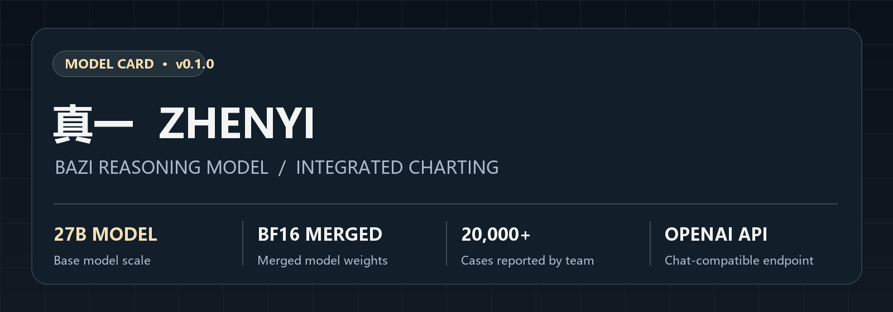
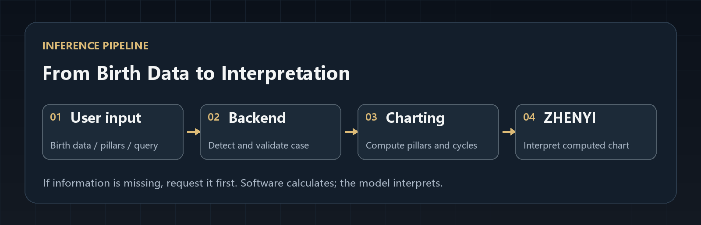
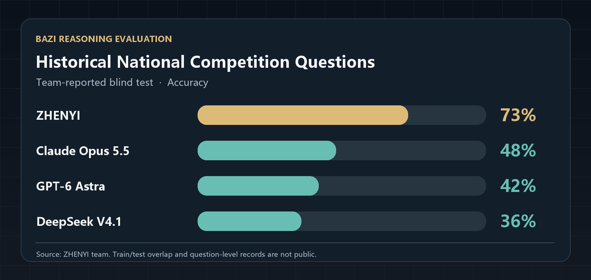

**Languages:** [简体中文](README.md) · English · [日本語](README.ja.md)

# ZHENYI 真一

### The world's first AI fortune-telling language model

**Send birth details or four pillars and ask your question.** The ZHENYI backend detects the case and calculates the chart with its bundled program. The model then interprets it using Blind School methods as its main framework, drawing on Wangshuai, Ziping, and Tiaohou approaches to explain its reasoning. Try it online, or download the merged model and source code to host and extend it yourself.

**27B Bazi reasoning model · Merged BF16 weights · Integrated charting · OpenAI-compatible API**



[Try online](https://www.zhenyi.org) · [Model weights](https://github.com/ZHENYI-ORG/zhenyi-mingli-ai/releases/tag/v0.1.0) · [Evaluation](#evaluation) · [Quick start](#quick-start) · [API](#api-usage) · [Contribute](#why-open-source)

**Prefer not to deploy? [Try ZHENYI online at www.zhenyi.org](https://www.zhenyi.org).**

## About ZHENYI

ZHENYI is an open-source language model project for Bazi (Four Pillars) interpretation. Blind School methods form its core. The project also draws on Wangshuai (strength and weakness), Ziping, and Tiaohou (climate adjustment) approaches. Our aim is to examine how these schools support or challenge one another when applied to the same chart, and to give interpretations with stated reasoning.

Users can send birth details or four pillars and ask a question through a standard chat interface. The backend identifies the case, checks the supplied information, calls the included charting program to calculate the pillars and luck cycles, then passes the result to the model. **Software calculates the chart; the model interprets it.**

## Model overview

| Item | Details |
| --- | --- |
| Model scale | 27B |
| ZHENYI release | v0.1.0 |
| Format | Merged BF16 model; load one model directory at inference time |
| Training material | The project team reports using over 20,000 real cases alongside material from several Bazi schools |
| Interface | OpenAI-compatible `/v1/chat/completions` and `/v1/models` |
| Charting | The bundled program calculates pillars and luck cycles; the backend requests missing information |
| Public artifacts | Merged weights, charting source, chat backend, web interface, and deployment scripts |

The public repository and Release do not contain the original training texts, case answers, private method prompts, or private evaluation records.

## How it works



The backend identifies cases in the conversation. If key birth information is missing, it asks the user to provide it. For complete cases, the charting program performs the calculations and the model writes the analysis. The same endpoint can also handle ordinary conversation. See the [integration guide](docs/MODEL_INTEGRATION.md) for implementation details.

## Evaluation



The project team compared ZHENYI with general-purpose models on **questions from past national fortune-teller competitions** and describes this evaluation as a blind test. The team-reported accuracy figures are:

| Model | Accuracy |
| --- | ---: |
| **ZHENYI** | **73%** |
| Claude Opus 5.5 | 48% |
| GPT-6 Astra | 42% |
| DeepSeek V4.1 | 36% |

> **Evaluation status:** The scores and the “blind test” description come from the project team. Question-level prompts, model outputs, grading records, possible overlap with training data, and model settings have not been published, so these results cannot yet be independently reproduced. The exact DeepSeek V4.1 variant also remains unspecified.

## Model download

| Artifact | Location | Purpose |
| --- | --- | --- |
| Merged model weights | [v0.1.0 Release](https://github.com/ZHENYI-ORG/zhenyi-mingli-ai/releases/tag/v0.1.0) | Download every split asset and reconstruct the model directory |
| Reconstruction script | [scripts/reconstruct-model.py](scripts/reconstruct-model.py) | Verify SHA-256 checksums and rebuild the files |
| Source and deployment configuration | This repository | Backend, charting program, web app, and launch scripts |

The Release contains **merged weights**: ZHENYI's fine-tuning has been incorporated into the base weights, so no separate LoRA adapter is needed at deployment. Allow sufficient disk space and inference hardware for a BF16 model of this size.

## Quick start

If you only want to explore the model, use the [online experience](https://www.zhenyi.org) without deploying it.

Self-hosting requires Node.js 20+, Python 3, and a compatible [ms-swift](https://github.com/modelscope/ms-swift) inference environment. Download all Release assets, reconstruct the model, and build the backend:

```bash
gh release download v0.1.0 --repo ZHENYI-ORG/zhenyi-mingli-ai --dir model-assets
python3 scripts/reconstruct-model.py model-assets model/zhenyi
npm ci
npm run build
```

Start the model service in one terminal:

```bash
export MODEL_PATH="$PWD/model/zhenyi"
export SWIFT_BIN=/path/to/swift
bash scripts/start-model-service.sh
```

Start the ZHENYI backend and web app in a second terminal:

```bash
export ZHENYI_MODEL_BASE_URL=http://127.0.0.1:8000/v1
export ZHENYI_MODEL_NAME=ZHENYI
export PORT=8787
bash scripts/start-web.sh
```

See the [deployment guide](docs/MODEL_INTEGRATION.md) for memory requirements, access keys, and additional options.

## API usage

Clients send standard chat messages; the backend handles case detection and charting.

```bash
curl http://localhost:8787/v1/chat/completions \
  -H 'Content-Type: application/json' \
  -d '{"model":"ZHENYI","messages":[{"role":"user","content":"乾造，四柱为甲子 甲戌 戊寅 庚申。请分析事业。"}]}'
```

For an OpenAI-compatible SDK, set `base_url` to `http://localhost:8787/v1` and use `ZHENYI` as the model name. Multi-turn and streaming responses are supported.

## Why open source

I believe Blind School, Wangshuai, Ziping, and Tiaohou each hold part of the picture. The hard part is testing their ideas on the same cases and explaining the basis for a judgment when they disagree. ZHENYI starts with Blind School methods while taking the other schools seriously.

With more cases, feedback, and practitioners taking part, I hope ZHENYI will develop a coherent way of interpreting charts. Perhaps that approach will eventually go beyond what we can articulate today. That is an ambition to test, not a result we claim to have proved.

We open-sourced the project so practitioners, researchers, and developers can inspect the charting program, discuss interpretations, report mistakes, and propose better evaluations. Contributions and issues are welcome.

## License and citation

- Source code: [MIT License](LICENSE).
- ZHENYI's rights in the merged model and its fine-tuning modifications: [Apache License 2.0](LICENSE-MODEL). The upstream model's copyright and license still apply; see the [model notice](NOTICE-MODEL.md) and [third-party notices](THIRD_PARTY_NOTICES.md). Modification and redistribution are permitted under the applicable terms.
- To cite the project:

```bibtex
@misc{zhenyi2026,
  title        = {ZHENYI: An Open-Source Bazi Astrology Language Model},
  author       = {{ZHENYI-ORG}},
  year         = {2026},
  howpublished = {\url{https://github.com/ZHENYI-ORG/zhenyi-mingli-ai}}
}
```

## Star History

[](https://star-history.com/#ZHENYI-ORG/zhenyi-mingli-ai&Date)

Star History generates this live chart from the repository's public GitHub stars. The project is newly open-sourced, so the curve will develop as people discover it. Click the chart for the current data.
