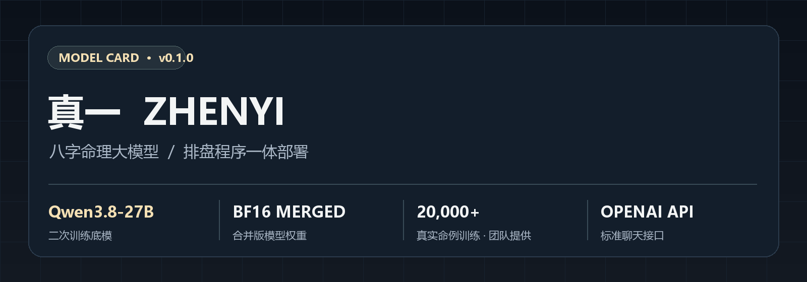
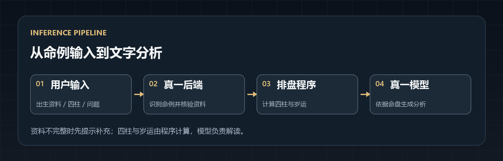
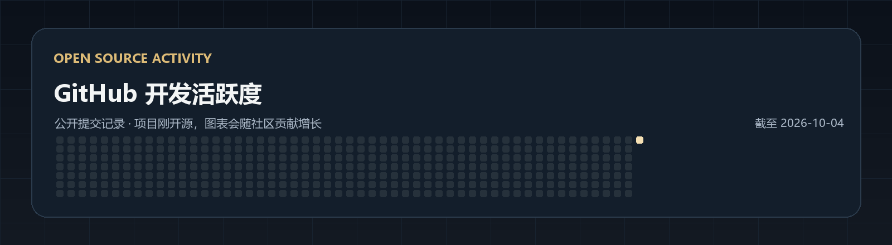

# 真一 ZHENYI

### 全球首个 AI 算命命理大模型

**基于 Qwen3.8-27B 二次训练 · 合并版 BF16 权重 · 内置程序排盘 · 标准聊天接口**



[在线体验](https://www.zhenyi.org) · [模型权重](https://github.com/ZHENYI-ORG/zhenyi-mingli-ai/releases/tag/v0.1.0) · [评测结果](#评测结果) · [快速部署](#快速部署) · [API 调用](#api-调用) · [参与项目](#为什么开源)

**不想部署？直接前往 [www.zhenyi.org](https://www.zhenyi.org) 在线体验真一。**

## 目录

- [项目简介](#项目简介)
- [模型概览](#模型概览)
- [工作流程](#工作流程)
- [评测结果](#评测结果)
- [模型下载](#模型下载)
- [快速部署](#快速部署)
- [API 调用](#api-调用)
- [为什么开源](#为什么开源)
- [许可与引用](#许可与引用)
- [GitHub 开发活跃度](#github-开发活跃度)

## 项目简介

真一是一款面向八字命理分析的开源大模型项目。我们以盲派理法和技法为核心，同时吸收旺衰派、子平派、调候派的理论与师傅经验，希望让不同流派的判断在同一张命盘上相互检验，形成有依据的解读。

用户可以像使用普通聊天模型一样，发送出生资料或四柱并直接提问。真一后端负责识别命例、核验资料、调用排盘程序计算四柱与岁运，再将结果交给模型分析。**排盘由程序计算，模型负责解读。**

## 模型概览

| 项目 | 说明 |
| --- | --- |
| 底模 | Qwen3.8-27B |
| 真一版本 | v0.1.0 |
| 模型格式 | 已合并微调权重的 BF16 模型；部署时加载单个模型目录 |
| 训练资料 | 项目团队提供两万多个真实命例，并整合多流派理论与经验 |
| 推理入口 | OpenAI 兼容的 `/v1/chat/completions` 和 `/v1/models` |
| 排盘能力 | 配套程序完成四柱、岁运等计算；资料不足时提示补充 |
| 开源内容 | 合并版模型权重、排盘源码、聊天后端、网页和部署脚本 |

训练原文、命例答案、私有理法提示词和私人回测记录不在公开仓库或 Release 中。

## 工作流程



后端会从当前对话中识别命例；若出生信息不足，会提醒用户补充。完整命例由配套排盘程序计算，模型基于排盘结果生成文字分析。普通聊天也可以通过同一接口完成。技术细节见 [模型与排盘一体部署文档](docs/MODEL_INTEGRATION.md)。

## 评测结果


项目团队使用历届全球命理师大赛的 **500 多道题**测试真一。按团队提供的信息，在同批题目、同一判分标准下，真一正确率为 **83%**，人类冠军为 **40%**。这个结果让我们震惊，也让我们更想继续检验它。

> **评测说明：**以上数字由项目团队提供。逐题题目、模型回答与判分记录尚未公开，因此目前属于团队自测结果，尚无可独立复核的公开报告。后续欢迎社区共同设计新的公开评测。

## 模型下载

| 文件 | 位置 | 用途 |
| --- | --- | --- |
| 合并版模型权重 | [v0.1.0 Release](https://github.com/ZHENYI-ORG/zhenyi-mingli-ai/releases/tag/v0.1.0) | 下载全部分卷附件后还原完整模型目录 |
| 还原脚本 | [scripts/reconstruct-model.py](scripts/reconstruct-model.py) | 校验 SHA-256 并重建模型文件 |
| 源码与部署配置 | 本仓库 | 后端、排盘程序、网页和启动脚本 |

模型权重作为本仓库的 Release 附件发布，属于**已合并版**：真一微调结果已经写入底模权重，部署时无须单独加载 LoRA。模型体积较大，请准备足够的磁盘空间和适配 BF16 模型的推理硬件。

## 快速部署

如果只想体验模型，无需自行部署，可直接访问 [真一在线体验](https://www.zhenyi.org)。

需要 Node.js 20+、Python 3，以及支持该模型的 [ms-swift](https://github.com/modelscope/ms-swift) 推理环境。先下载全部 Release 附件，按校验值还原模型，再构建后端：

```bash
gh release download v0.1.0 --repo ZHENYI-ORG/zhenyi-mingli-ai --dir model-assets
python3 scripts/reconstruct-model.py model-assets model/zhenyi
npm ci
npm run build
```

在第一个终端启动模型服务：

```bash
export MODEL_PATH="$PWD/model/zhenyi"
export SWIFT_BIN=/path/to/swift
bash scripts/start-model-service.sh
```

在第二个终端启动真一后端与网页：

```bash
export ZHENYI_MODEL_BASE_URL=http://127.0.0.1:8000/v1
export ZHENYI_MODEL_NAME=ZHENYI
export PORT=8787
bash scripts/start-web.sh
```

显存需求、访问密钥和更多配置见 [部署文档](docs/MODEL_INTEGRATION.md)。

## API 调用

客户端只需调用标准聊天接口；后端会自动处理命例识别和排盘。

```bash
curl http://localhost:8787/v1/chat/completions \
  -H 'Content-Type: application/json' \
  -d '{"model":"ZHENYI","messages":[{"role":"user","content":"乾造，四柱为甲子 甲戌 戊寅 庚申。请分析事业。"}]}'
```

兼容 OpenAI SDK 的客户端可将 `base_url` 设为 `http://localhost:8787/v1`，模型名设为 `ZHENYI`。接口支持多轮对话与流式响应。

## 为什么开源

我一直觉得，盲派、旺衰派、子平派和调候派都掌握着命理真相的一部分。难的是把这些经验放到同一个命例里检验，遇到分歧时说明判断依据。真一从盲派出发，也认真吸收其他流派的看法。

我相信，随着更多命例、反馈和不同流派的经验进入项目，真一会逐渐形成自己的解读逻辑。这套逻辑也许有一天能超出人类现有的解读范畴，达到我们今天还想象不到的高度。这是期待，仍要靠后续测试检验。

我选择开源，是希望更多师傅、研究者和开发者参与。欢迎检查排盘、讨论判断、指出错误，也提出更好的验证办法。让懂行的人一起把问题找出来，真一才能继续往前走。

## 许可与引用

- 本仓库源码采用 [MIT License](LICENSE)。
- 真一合并版模型权重及真一训练形成的增量采用 [Apache License 2.0](LICENSE-MODEL)；底模版权与原有许可仍须遵守，见 [模型许可说明](NOTICE-MODEL.md)及 [第三方声明](THIRD_PARTY_NOTICES.md)。允许按许可修改和再发布。
- 如在研究或项目中使用真一，可引用本仓库：

```bibtex
@misc{zhenyi2026,
  title        = {ZHENYI: An Open-Source Bazi Astrology Language Model},
  author       = {{ZHENYI-ORG}},
  year         = {2026},
  howpublished = {\url{https://github.com/ZHENYI-ORG/zhenyi-mingli-ai}}
}
```

## GitHub 开发活跃度



图中仅统计公开仓库提交，截取日期见图片右上角。项目刚开源，社区贡献会持续增加；查看 [GitHub 实时活动](https://github.com/ZHENYI-ORG/zhenyi-mingli-ai/activity)。
